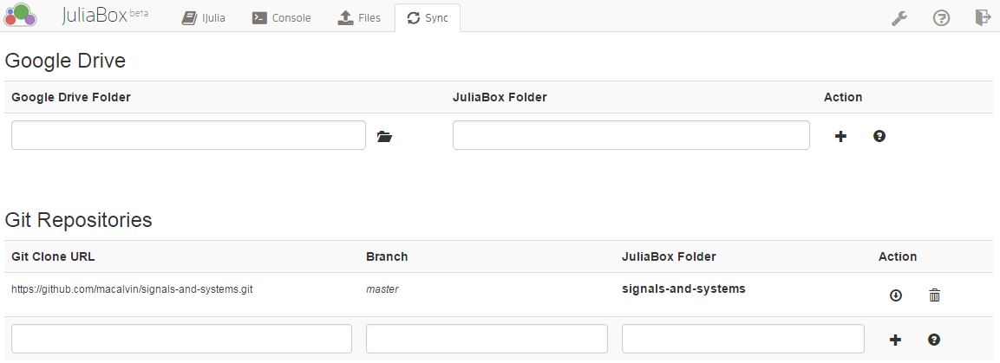
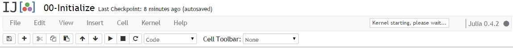
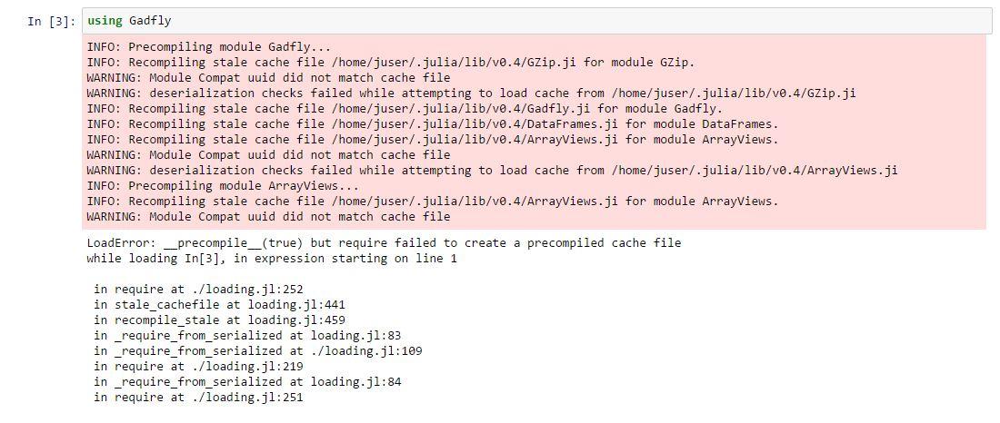

##Getting started with JuliaBox
1. Sign in to JuliaBox (http://www.juliabox.org/) with a google account. Create a google account if necessary.
2. Click on the **Sync** tab on the top menu bar of JuliaBox
3. Add the git repository by copying the following link  into the **Git Clone URL**: https://github.com/macalvin/notebooks/signals-and-systems.git The other boxes should fill in automatically. Press the **+** to accept. If the other details are not filled in, set **Branch** as *master*, **JuliaBox Folder** as *signals-and-systems*. 
  
4. Return to the **IJulia** tab and the *signals-and-systems* directory should be visible.
5. In the *signals-and-systems* directory, open the notebook named *00-Initialize.ipynb*
6. Wait for the kernel to finish connecting. The status is shown in a box left of the kernel version *Julia 0.4.2*. If there is no box, the kernel is loaded.
  
7. Run all cells by clicking on the file menu **Cell>Run all**. This will take a few minutes. When the notebook is Running a [\*] will be seen on the left of the highlighted cell. Do not be alarmed if you see errors.
  
8. Restart the kernel by clicking on the file menu **Kernel>Restart**
9. Rerun all the cells **Cell>Run all**. This time there should be no errors, warnings are fine.

You are now ready to explore other notebooks!

